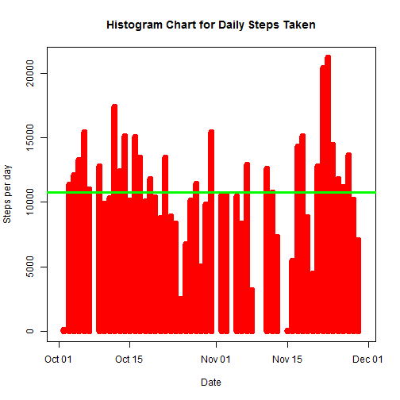
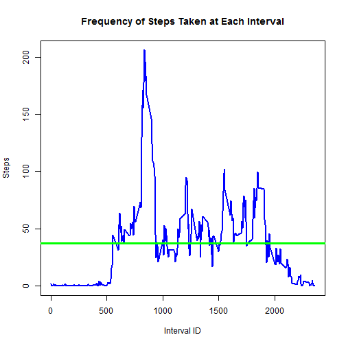
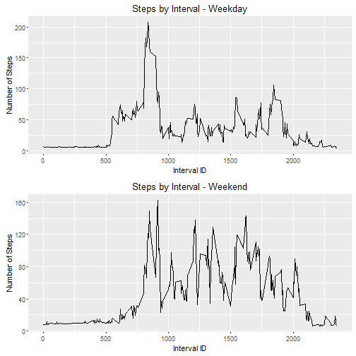

# Load data from file activity.csv

```r
# Read data from activity.csv into "kbactivity.data" vector
kbactivity.data<- read.csv(file="C:\\Rproject\\kb\\ReproduceableResearch\\Project1\\activity.csv")

# Format/convert date data from factor to date
kbactivity.data$date <- as.Date(kbactivity.data$date)
```
# Prepare/process data for plotting and analysis

```r
# Load reshape2 library to get melt and dcast functions
library(reshape2)

# Melt data frame to prepare for casting by date -- by setting the id variable to date and the measure variable to steps, we get a table with multiple values for steps taken within each day
kbactivity.data.MeltDate <- melt(kbactivity.data,id.vars="date", measure.vars="steps", na.rm=FALSE)

# Cast data-frame to see steps/day -- this sums the steps by date to give us a talbe of 3 columns and 61 rows

kbactivity.data.CastDate <- dcast(kbactivity.data.MeltDate, date ~ variable, sum)
```

# What is mean total number of steps taken per day ?


```r
# Produce a histogram of the total number of steps taken each day with their mean

plot(kbactivity.data.CastDate$date, kbactivity.data.CastDate$steps, type="h", main="Histogram Chart for Daily Steps Taken", xlab="Date",ylab="Steps per day", col="red", lwd=8)
abline(h=mean(kbactivity.data.CastDate$steps, na.rm=TRUE), col="green", lwd=3)
```



```r
# Calculate and report the Mean and Median total number of steps taken per day

paste("Mean Steps per Day =", mean(kbactivity.data.CastDate$steps, na.rm=TRUE))
```

```
## [1] "Mean Steps per Day = 10766.1886792453"
```

```r
paste("Median Steps per Day =", median(kbactivity.data.CastDate$steps, na.rm=TRUE))
```

```
## [1] "Median Steps per Day = 10765"
```

# What is the average daily activity pattern ?


```r
# Make a time series plot (i.e.  type = "l" ) of the 5-minute interval (x-axis) and the average number of steps taken, averaged across all days (y-axis)
# Re-melt data-frame to prepare for casting by interval, including removing NA values so we can take the mean a little later

kbactivity.data.MeltInt <- melt(kbactivity.data, id.vars="interval", measure.vars="steps", na.rm=TRUE)

# Cast data-frame to see mean steps per interval

kbactivity.data.CastInt <- dcast(kbactivity.data.MeltInt, interval ~ variable, mean)

# Which 5-minute interval, on average across all the days in the dataset, contains the maximum number of steps?
# Plot line chart with average frequency of steps by interval and add lin with mean

plot(kbactivity.data.CastInt$interval, kbactivity.data.CastInt$steps, type="l", main="Frequency of Steps Taken at Each Interval", xlab="Interval ID", ylab="Steps", col="blue", lwd=2)

abline(h=mean(kbactivity.data.CastInt$steps, na.rm=TRUE), col="green", lwd=3)
```



```r
# The plot provide the peak at the 800-900 range interval, so let's find out exactly which interval has the maximum value and what is that maximum value?

# Interval that has maximum value 

paste("Interval with maximum value =", kbactivity.data.CastInt$interval[which(kbactivity.data.CastInt$steps == max(kbactivity.data.CastInt$steps))])
```

```
## [1] "Interval with maximum value = 835"
```

```r
paste("Maximum interval mean steps =", max(kbactivity.data.CastInt$steps))
```

```
## [1] "Maximum interval mean steps = 206.169811320755"
```

# Imputing missing valuess

```r
# Note that there are a number of days/intervals where there are missing values (coded as NA). The presence of missing days may introduce bias into some calculations or summaries of the data.
# Calculate and report the total number of missing values in the dataset (i.e. the total number of rows with NAs)
sum(is.na(kbactivity.data$steps))
```

```
## [1] 2304
```

```r
# Devise a strategy for filling in all of the missing values in the dataset. The strategy does not need to be sophisticated. For example, you could use the mean/median for that day, or the mean for that 5-minute interval, etc.
# There are 2304 missing values (NA), I plan to replace NAs with the mean for the particular interval number. for e.g., if the average number of steps taken during interval x is y, I will replace each NA with the corresponding y value for that row. I will then recalculate the steps per day to see how much it differs from the orginal result.

# Create new data set with imputed NA values, 
# rename data-frame ith mean step per interval

kbactivity.data.StepsPerInt <- kbactivity.data.CastInt

# Create data-frame that we will remove NAs from

kbactivity.data.NoNA <- kbactivity.data

# Merge activity above two data sets

kbactivity.data.Merge = merge(kbactivity.data.NoNA, kbactivity.data.StepsPerInt, by="interval", suffixes=c(".act", ".spi"))

# Get list of indexes where steps value = NA

kbactivity.data.NAIndex = which(is.na(kbactivity.data.NoNA$steps))

# Replace NA values with value from steps.spi

kbactivity.data.NoNA[kbactivity.data.NAIndex,"steps"] = kbactivity.data.Merge[kbactivity.data.NAIndex,"steps.spi"]

# Make a histogram of the total number of steps taken each day and Calculate and report the mean and median total number of steps taken per day. Do these values differ from the estimates from the first part of the assignment? What is the impact of imputing missing data on the estimates of the total daily number of steps?

# Melt new data-frame to prep for casting by date

kbactivity.data.MeltDateNoNA <- melt(kbactivity.data.NoNA, id.vars="date", measure.vars="steps", na.rm=TRUE)

# Cast data-frame to see steps per day

kbactivity.data.CastDateNoNA <- dcast(kbactivity.data.MeltDateNoNA, date ~ variable, sum)

# Plot histogram with frequency of step by day

plot(kbactivity.data.CastDateNoNA$date, kbactivity.data.CastDateNoNA$steps, type="h", main="Histrogram of Daily Steps (Imputted NA Values)", xlab="Date", ylab="Steps", col="blue", lwd=6)
abline(h=mean(kbactivity.data.CastDateNoNA$steps), col="green", lwd=3)
```


```r
# Calulate mean and median of daily steps without NA
paste("Mean daily steps =", mean(kbactivity.data.CastDateNoNA$steps, na.rm=TRUE))
```

```
## [1] "Mean daily steps = 10889.7992576554"
```

```r
paste("Median daily steps =", median(kbactivity.data.CastDateNoNA$steps, na.rm=TRUE))
```

```
## [1] "Median daily steps = 11015"
```

```r
# Note the difference in values: 
# Original Data set with NA values - Mean daily steps = 10,766.19 and Median daily steps = 10,765
# New data set with NA imputted with mean value for that interval - Mean daily steps = 10,890 and Medial daily steps = 11,015

# There 1.2% and 2.3% difference for mean and median respectively between orginal and new data set. However, the maximum daily value in the set with NA vs the set with replace NAs was 21,194 vs 24,150, resulting in significant difference of 13.9%
```
# Are there differences in activity patterns between weekdays and weekends?


```r
# Create a new factor variable in the dataset with two levels - "weekday" and "weekend" indicating whether a given date is a weekday or weekend day.

# For loop to create new column called "dayofweek" and insert wheather each date corresponds to a weekday or weekend

for (i in 1:nrow(kbactivity.data.NoNA)) {
    if (weekdays(kbactivity.data.NoNA$date[i]) == "Saturday" | weekdays(kbactivity.data.NoNA$date[i]) == "Sunday") {
      kbactivity.data.NoNA$dayofweek[i] = "weekend"
    } else {
      kbactivity.data.NoNA$dayofweek[i] = "weekday"
    }
}

# Subset, process and plot two charts on top of of each other to compare weekday vs weekend activity
# To Create a plot, we must first subset the data

kbactivity.data.Weekday <- subset(kbactivity.data.NoNA, dayofweek=="weekday")
kbactivity.data.Weekend <- subset(kbactivity.data.NoNA, dayofweek=="weekend")

# Next step is to process the data for our plot needs

kbactivity.data.MeltWeekday <- melt(kbactivity.data.Weekday, id.vars="interval", measure.vars="steps")
kbactivity.data.MeltWeekend <- melt(kbactivity.data.Weekend, id.vars="interval", measure.vars="steps")
kbactivity.data.CastWeekday <- dcast(kbactivity.data.MeltWeekday, interval ~ variable, mean)
kbactivity.data.CastWeekend <- dcast(kbactivity.data.MeltWeekend, interval ~ variable, mean)

# load library packages for ploting
library(ggplot2)
library(gridExtra)

# Define plot area to two rows and one column, and then plot charts with mean line in each

plot1 <- qplot(kbactivity.data.CastWeekday$interval, kbactivity.data.CastWeekday$steps, geom="line", data=kbactivity.data.CastWeekday, main="Steps by Interval - Weekday", xlab="Interval ID", ylab="Number of Steps")

plot2 <- qplot(kbactivity.data.CastWeekend$interval, kbactivity.data.CastWeekend$steps, geom="line", data=kbactivity.data.CastWeekend, main="Steps by Interval - Weekend", xlab="Interval ID", ylab="Number of Steps")

grid.arrange(plot1, plot2, nrow=2)
```




